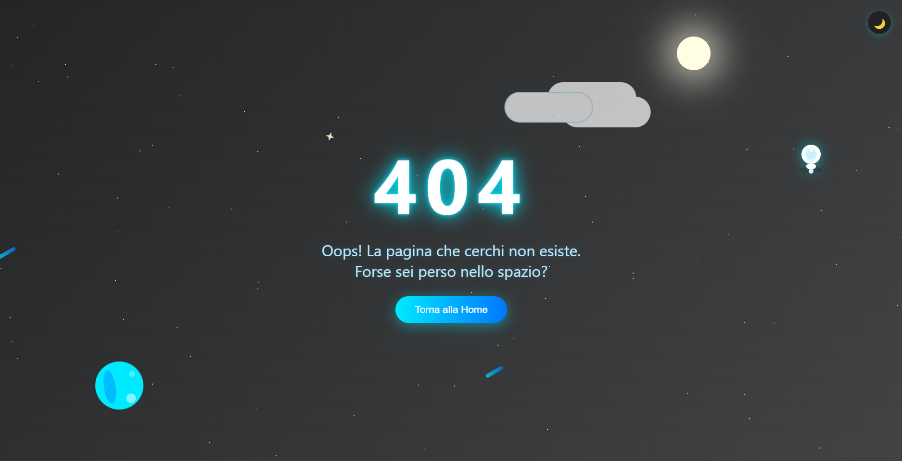

# Pagina 404 Animata e Decorativa 🚀

## 🇮🇹 Italiano

Questa è una pagina 404 altamente decorativa e animata, ideale per siti web moderni che vogliono sorprendere l’utente anche quando si perde! Include animazioni CSS, elementi SVG, tema chiaro/scuro, meteoriti, pianeti, nuvole, stelle, astronauta fluttuante, luna animata, effetti interattivi e un easter egg.

### Funzionalità

- **Animazioni CSS**: testo rimbalzante, pulsazioni, nuvole e luna animate, pianeta rotante, meteoriti in movimento.
- **Tema chiaro/scuro**: selezionabile con un click.
- **Stelle animate**: sfondo dinamico con effetto twinkle.
- **Astronauta e pianeta SVG**: elementi grafici vettoriali animati.
- **Effetto sparkle**: segue il mouse e reagisce al click.
- **Responsive**: si adatta a dispositivi mobili.
- **Easter egg**: premi "S" sulla tastiera!
- **Bottone per tornare alla home**.

### Anteprima

 <!-- Inserisci uno screenshot se disponibile -->

### Utilizzo

1. Copia il file `index.html` nella cartella desiderata del tuo sito.
2. Personalizza il bottone "Torna alla Home" se necessario.
3. (Opzionale) Personalizza colori, testi o aggiungi il tuo logo.

### Personalizzazione

- Modifica i colori nel CSS per adattarli al tuo brand.
- Cambia il testo o aggiungi altri elementi SVG.
- Puoi aumentare o diminuire il numero di stelle/meteoriti modificando lo script JS.

---

## 🇬🇧 English 

This is a highly decorative and animated 404 page, perfect for modern websites that want to surprise users even when they get lost! It features CSS animations, SVG elements, light/dark theme, meteors, planets, clouds, animated stars, floating astronaut, animated moon, interactive effects, and an easter egg.

### Features

- **CSS Animations**: bouncing text, pulsing buttons, animated clouds and moon, rotating planet, moving meteors.
- **Light/Dark theme**: switchable with one click.
- **Animated stars**: dynamic twinkling background.
- **SVG Astronaut and planet**: animated vector graphics.
- **Sparkle effect**: follows the mouse and reacts to clicks.
- **Responsive**: adapts to mobile devices.
- **Easter egg**: press "S" on your keyboard!
- **Button to return home**.

### Preview

 <!-- Add a screenshot if available -->

### Usage

1. Copy the `index.html` file to your desired website folder.
2. Customize the "Back to Home" button if needed.
3. (Optional) Adjust colors, texts, or add your logo.

### Customization

- Change CSS colors to match your brand.
- Edit the text or add more SVG elements.
- Increase or decrease the number of stars/meteors by editing the JS script.

---

**Autore / Author:** [RomanDev](https://www.romandev.it)

**Licenza / License:** [GPL](LICENSE)

**Test** [You can test the page in my site / prova la pagina andando sul mio sito!](https://www.romandev.it/projects/404)

